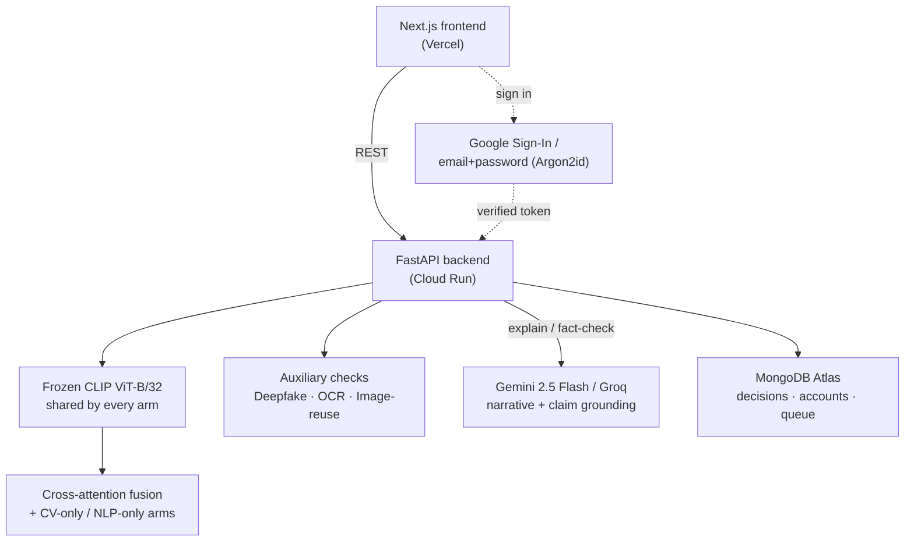

<div align="center">


<a href="https://multimodal-content-moderation.vercel.app"></a>

<br/>

[](https://multimodal-content-moderation.vercel.app)
[](https://vanguard-moderation-api-2wr445ogxq-el.a.run.app/api/v1/health)
[](https://huggingface.co/Aadithya1122/vanguard-moderation-checkpoints)


-red?style=flat-square)

</div>


Single-signal moderation fails in two directions. It **misses** harm that only
exists jointly — an innocuous photo plus an innocuous caption that together
imply a threat — and it **over-flags** when context is missing, like a violent
news photograph whose caption makes clear it's reporting, not glorifying.
Averaging two "safe" scores stays safe, so late fusion structurally cannot
catch the first case. Vanguard keeps the raw representations alive through a
cross-attention block so joint patterns can actually be learned, and measures
the difference against a late-fusion baseline honestly — including when the
result doesn't clear statistical significance.

This is a **decision-support tool for human moderators**, not an autonomous
ban-hammer. Every verdict's `auto_action` field is hard-typed `None` in the
API schema — not a policy the frontend happens to follow, a contract the
backend cannot violate without changing the type.

<div align="center">

### [→ Try it live](https://multimodal-content-moderation.vercel.app) &nbsp;·&nbsp; [Full report](reports/REPORT.md) &nbsp;·&nbsp; [API docs](docs/api.md) &nbsp;·&nbsp; [Architecture](PROJECT_CONTEXT.md)

</div>


## Contents

- [What you can actually do with it](#what-you-can-actually-do-with-it)
- [Architecture](#architecture)
- [Status](#status)
- [Results](#results)
- [Beyond the original plan](#beyond-the-original-plan)
- [Setup](#setup)
- [Data](#data)
- [Running the stack locally](#running-the-stack-locally)
- [Layout](#layout)
- [Hardware](#hardware)


## What you can actually do with it

Open **[the live app](https://multimodal-content-moderation.vercel.app)** —
no account needed for either of these:

| Action | What happens |
|---|---|
| **Analyze** an image and/or caption | Runs the full fusion pipeline: CV-only, NLP-only, and cross-attention scores, an emergent-signal flag (harm visible only in the combination), a Grad-CAM heatmap, occlusion-based token attribution, image-reuse detection, and a plain-English LLM narrative |
| **Check a claim** ("Is this true?") | A live, web-search-grounded check of the caption's own factual claim — independent of the misinformation head, which predicts a learned pattern rather than verifying the specific claim. Verdict: `supported` / `contradicted` / `unclear` / `no_factual_claim`, with real cited sources |
| **Record a decision** (requires sign-in) | Approve / remove / escalate / defer, logged against a verified identity — Google Sign-In or an email/password account, your choice |


## Architecture



Two signals join the verdict **without** passing through cross-attention, each
for a stated reason: the deepfake branch reasons about pixel-level artifacts
unrelated to caption semantics, and image-reuse is a CLIP cosine-similarity
search against every previously analyzed image (threshold 0.90, set
empirically against real near-duplicate degradation, not assumed). Both are
purely informational — a moderator's own read of the evidence, never a hidden
input to the score.


## Status

| Stage | State |
|---|---|
| 1. Dataset download + preprocessing | done |
| 2. Unimodal baselines (CV-only, NLP-only) | done |
| 3. Late fusion baseline | done |
| 4. Cross-attention fusion (core contribution) | done |
| 5. Deepfake branch | done — score-level, outside the attention block |
| 6. Explainability layer (occlusion / Grad-CAM / LLM) | done |
| 7. Ablation study + evaluation | done, including a deletion-test faithfulness eval |
| 8. FastAPI backend | done — persisted to MongoDB Atlas |
| 9. Frontend | done — Google + email/password sign-in for decisions |
| 10. Deployment | done — Cloud Run + Vercel, ~12s cold start |

Full architecture and rationale: [PROJECT_CONTEXT.md](PROJECT_CONTEXT.md).
API contract: [docs/api.md](docs/api.md). Deployment: [docs/deployment.md](docs/deployment.md).
Full academic report, including every honest limitation found along the way:
[reports/REPORT.md](reports/REPORT.md).


## Results

Test macro-F1, mean ± sd across seeds. Every arm shares an identical
`MultiTaskHead` on a frozen CLIP ViT-B/32 backbone, so a difference reflects
what feeds the head rather than one arm having a larger classifier. Each arm was
given its own hyperparameter search, selected on validation only.

### Hateful Memes — built so neither modality alone is offensive

| Arm | Seeds | Test macro-F1 | 95% CI | AUC |
|---|---|---|---|---|
| CV-only | 3 | 0.6217 ± 0.0064 | [0.606, 0.637] | 0.678 |
| NLP-only | 3 | 0.6283 ± 0.0098 | [0.604, 0.653] | 0.686 |
| Late fusion | 5 | 0.6910 ± 0.0074 | [0.682, 0.700] | 0.764 |
| **Cross-attention** | 7 | **0.7035 ± 0.0120** | [0.692, 0.715] | 0.769 |

Cross-attention − late fusion = **+0.0125**, Welch's t = 2.217, **p = 0.051**.

### Fakeddit — text alone often carries the label

| Arm | Seeds | Test macro-F1 | 95% CI | AUC |
|---|---|---|---|---|
| CV-only | 3 | 0.6863 ± 0.0040 | [0.676, 0.696] | 0.883 |
| NLP-only | 3 | 0.7031 ± 0.0030 | [0.696, 0.711] | 0.875 |
| **Late fusion** | 5 | **0.7732 ± 0.0085** | [0.763, 0.784] | 0.926 |
| Cross-attention | 5 | 0.7705 ± 0.0069 | [0.762, 0.779] | 0.914 |

Cross-attention − late fusion = **−0.0027**, Welch's t = −0.553, **p = 0.596**.

### What this shows

Both benchmarks agree on the large effect: either modality alone is weak, and
using both helps substantially — roughly 7 points on Hateful Memes and 7 on
Fakeddit. That gap is the project's premise and it is not in doubt.

The two benchmarks disagree on the smaller question of *how* to combine them,
and the disagreement is the interesting result. Cross-attention edges ahead
precisely on the dataset Meta engineered so that neither modality alone is
offensive, and does nothing on the one where a single modality usually suffices.
A merely larger model would have won on both or neither; winning only where
cross-modal reasoning is actually required is evidence about the mechanism.

**Neither gap is statistically separable from seed noise** (p = 0.051 and
p = 0.596), and this is reported as such rather than rounded into a win. At
8,500 training memes, a 14M-parameter block trained from scratch is
under-resourced, and the honest reading is that cross-modal attention pays off
in proportion to how much the task demands it — suggestively on Hateful Memes,
not at all on Fakeddit.

### Recall on the cases both unimodal arms missed

The figure PROJECT_CONTEXT Sec. 6 names most important: harmful memes where
*neither* the vision-only nor the language-only arm crosses threshold. Unimodal
recall on this subset is 0 by construction.

| Arm | Recall on hard cases |
|---|---|
| Late fusion | 27.5% ± 4.9% |
| Cross-attention | 30.9% ± 4.1% |

+3.4%, p = 0.266 over 5 seeds. The hard subset averages 111 of 490 positives and
is itself seed-dependent (106–121), since it is defined by that seed's own
unimodal arms. A single-seed run of this measure gave −4.6%, in the opposite
direction — which is why it is reported with an error bar and not from one run.

### Explanation faithfulness (deletion test)

Mask the region the explanation names as most important, and a random
region of the same size, and compare how much each hurts the score
(`scripts/faithfulness_eval.py`, n=40 per dataset):

| Modality | Gap (top-region − random-region) | p |
|---|---|---|
| Text | +0.0978 (Hateful Memes), +0.0544 (Fakeddit) | **0.0001**, **0.018** — faithful |
| Image | +0.0295 (Hateful Memes), +0.0195 (Fakeddit) | 0.16, 0.31 — right-signed, not yet significant at this n |

```bash
python scripts/encode_features.py --all
python scripts/sweep_fusion.py --arch cross_attention --datasets hateful_memes
python scripts/ablation_table.py --datasets hateful_memes fakeddit
python scripts/fusion_delta.py --dataset hateful_memes --seeds 1 2 3 4 5
python scripts/faithfulness_eval.py --datasets hateful_memes fakeddit --n 40
```


## Beyond the original plan

Four things exist that weren't in the original spec at all — built in response
to actually running the deployed service, not planned upfront.

**Live claim grounding.** `GET /items/{id}/fact-check` asks a genuinely
different question than anything else in this API: does the caption's own
claim hold up against current, real search results, right now — Gemini's
search-grounding tool does the round-trip. Deliberately independent of the
misinformation head (which predicts a learned pattern), opt-in on its own
rate-limited endpoint, since a real search costs more than explaining a score
the model already computed.

**Two independent ways to sign in.** Google Sign-In and self-issued
email/password accounts (Argon2id hashing, JWT, both verified server-side) —
either can sign a moderator decision. Closed a real gap: earlier, a decision
trusted whatever `moderator_id` string a client sent, unverified.

**Per-endpoint rate limiting.** `/analyze`, `/fact-check`, and `/auth/*` each
have their own budget — `/fact-check` shipped with none at all originally, a
real cost-exposure bug on a public URL doing billed search calls, caught and
closed mid-session.

**Two production bugs found by actually redeploying, not by code review**:
a queue filter that compared a 2-way and a 3-way classifier's raw scores as if
they were on the same scale (fixed with `active_heads`), and a Cloud Run
cold start that took 12 minutes instead of 30 seconds — traced through a real
but incomplete first fix to the actual cause (CPU throttling on the
background model-loading thread) by measuring again after the fix that didn't
fully work, not by trusting that it had.


## Setup

Targets Apple Silicon (MPS) with no CUDA anywhere.

```bash
uv venv --python 3.12
uv pip install -e ".[dev]"
```

Optional subsystems install separately so the base environment stays small:

```bash
uv pip install -e ".[xai]"    # SHAP, Grad-CAM, LIME
uv pip install -e ".[cv]"     # OpenCV, EasyOCR, YOLO
uv pip install -e ".[serve]"  # FastAPI, MongoDB, Gemini/Groq, Google/JWT auth
uv pip install -e ".[track]"  # Weights & Biases
```

Copy `.env.example` to `.env` and fill in the keys you need.

## Data

```bash
python scripts/prepare_data.py --all
```

Each dataset normalizes into one canonical record format
(`src/mcm/data/schema.py`) written as parquet manifests under
`data/processed/<dataset>/<split>.parquet`.

| Dataset | Role | train / val / test | Source |
|---|---|---|---|
| Hateful Memes | Core fusion thesis — neither modality alone is offensive | 8,500 / 500 / 1,000 | `neuralcatcher/hateful_memes` + `limjiayi/hateful_memes_expanded` |
| Fakeddit | Misinformation head, 6-way labels collapsed to 3 | 4,799 / 2,376 / 1,422 | `AdoCleanCode/Fakeddit`, `ams-99/fakeddit_9k` |
| HateXplain | Human token-level rationales — explanation ground truth | 15,383 / 1,922 / 1,924 | hate-alert/HateXplain |

37,826 rows total: 18,597 with images, 19,229 text-only.

Verify a prepared build at any time:

```bash
python scripts/inspect_data.py
```

### Two data problems this pipeline corrects

Both were present in the upstream sources and both would have quietly corrupted
the headline result, so they are fixed in code and reported loudly at build time
rather than left to be discovered later.

**Hateful Memes: 2,043 missing images.** The primary mirror ships 9,664 images
against a 10,000-row dataset, which looks complete. It is not — 1,707 of those
belong to the `unseen` splits, and 2,043 images referenced by
`train`/`dev_seen`/`test_seen` are absent. Skipping those rows would train on
79.6% of the data and evaluate on 815 of 1,000 test memes, with a shifted class
balance. The expanded mirror carries exactly those 2,043, so they are backfilled.

**Fakeddit: cross-split image leakage.** 25 images appear in more than one split
in the source partition (12 train/val, 10 train/test, 3 val/test). Training on
an image and then evaluating on it rewards memorization, so leaked images are
removed from the eval side.

Fakeddit runs in two tiers. `offline` (default) uses a mirror that bundles its
images, so the pipeline needs no scraping and is reproducible from a clean
clone. `scale` samples the 794k-row metadata table and fetches images from their
original URLs; a meaningful share of 2019-era Reddit links are dead, so the
realized sample is always smaller than requested.

```bash
python scripts/prepare_data.py --dataset fakeddit --tier scale --sample-size 40000
```

### The label sentinel

Hateful Memes has no misinformation label; Fakeddit has no harassment label.
Rather than inventing labels or training two disjoint models, inapplicable
labels are set to `IGNORE_INDEX` and masked out of the loss. Both heads sit on
one shared fused embedding, so every dataset trains the shared trunk while only
the applicable head receives gradient. This is what makes the multi-task setup
in the architecture honest, and it is the reason a single training loop can
produce the whole ablation table.

### Dataset licensing

These are research datasets with their own terms, and this repo ships none of
their content — only code that fetches it.

- **Hateful Memes** is released by Meta under a research licence via DrivenData.
  Using it here does not waive those terms; read and accept them before running
  the pipeline.
- **Fakeddit** is CC-BY-4.0 metadata referencing user-posted Reddit images.
- **HateXplain** is MIT-licensed and contains slurs and hate speech by
  construction, since that is what it annotates.


## Running the stack locally

```bash
uv pip install -e ".[serve]"
uvicorn mcm.serving.app:app --reload --port 8000
```

```bash
cd frontend && npm install && npm run dev
```

The frontend runs against fixtures with `NEXT_PUBLIC_USE_MOCK=true` in
`frontend/.env.local`, so the whole interface is buildable and demoable with no
backend running. Google Sign-In and MongoDB persistence are both optional —
unset, they degrade to "email/password only" and "in-memory, wiped on
restart" respectively, never to a silent failure. Exact setup for both:
[docs/deployment.md](docs/deployment.md).

## Layout

```
configs/data.yaml        dataset sources and preparation options
src/mcm/config.py        paths, dataset specs
src/mcm/utils/device.py  MPS/CPU selection (no CUDA anywhere)
src/mcm/data/schema.py   the canonical record format + validation
src/mcm/data/prepare/    one normalization pipeline per dataset
src/mcm/models/          CLIP encoder, heads, baselines, cross-attention fusion
src/mcm/training/        training loop, metrics, significance testing
src/mcm/explain/         Grad-CAM, occlusion attribution
src/mcm/serving/app.py   FastAPI application
src/mcm/serving/auth.py  Google + self-issued token verification
src/mcm/serving/accounts.py  email/password accounts (Argon2id, JWT)
src/mcm/serving/factcheck.py live web-search claim grounding
frontend/                Next.js interface
deploy/                  Dockerfile and serving requirements
scripts/                 data prep, feature caching, training, sweeps, analysis
```

## Hardware

MacBook Air M4, 24GB unified memory, MPS. The CLIP backbone stays frozen and
only the cross-attention layers and heads are trained — full CLIP fine-tuning is
not realistic in this memory budget, and freezing it is also what keeps the
unimodal and fusion arms of the ablation comparable.


